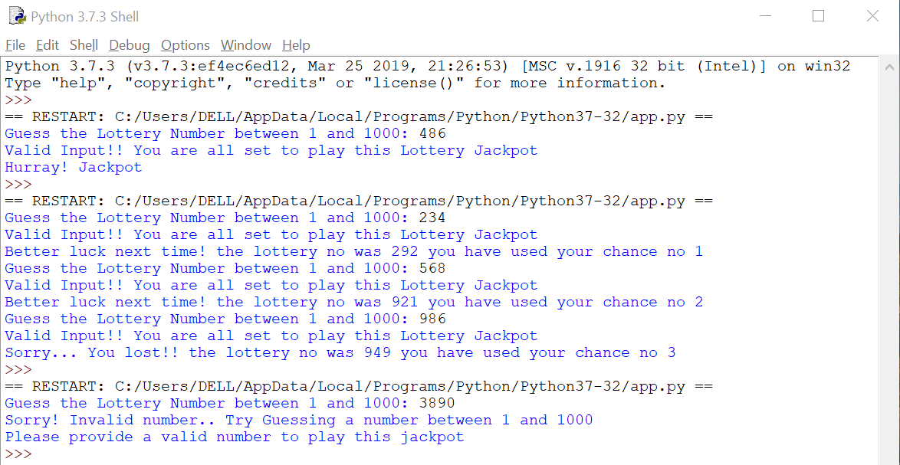

# LOTTERY GAME

> A Python program to perform a simple Lottery Game which provides users with 3 chances to win the game by guessing the lottery number which is randomly generated every time

## Table of contents
* [Technologies](#technologies)
* [Running the Application](#running-the-application)
* [Screenshot](#screenshots)
* [Contact](#contact)

## Technologies
* Technologies -  Python

## Running the Application
* Step 1: Open the app.py file in python shell and run the program

## Screenshot
 

## Contact
[Sabiha Begum Jaggir Hussain](https://sabihabegumj.com/) - feel free to contact me!
